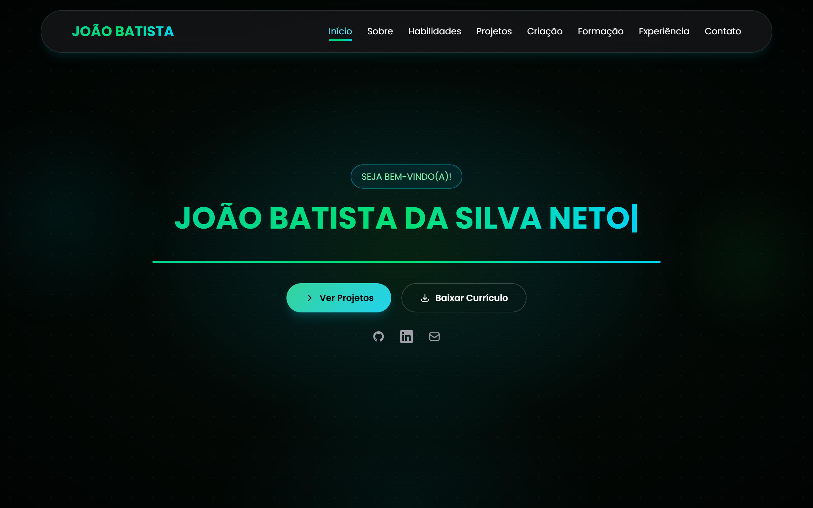

<div align="center">

# João Batista — Portfólio

**Desenvolvedor Front-End** · React · Next.js · TypeScript

[](https://joao-batista-portfolio.vercel.app)
[](https://react.dev)
[](https://www.typescriptlang.org)
[](https://vite.dev)
[](https://tailwindcss.com)
[](LICENSE)

</div>

```
$ whoami
João Batista da Silva Neto — Front-End Developer, Recife/PE
$ cat sobre.txt
Construo a aplicação inteira: layout no Figma, componentização, consumo de
API e interface responsiva, do zero até a produção.
$ ./projetos.sh --status
P.O.N.T.E   1º lugar   ██████████ concluído
Limpattack  1º lugar   ██████████ concluído
Benevo      2º lugar   ██████████ concluído
```

<div align="center">
  
</div>

🔗 **Demo:** [joao-batista-portfolio.vercel.app](https://joao-batista-portfolio.vercel.app)
📂 **Repositório:** [github.com/joaobatis1a/portfolio](https://github.com/joaobatis1a/portfolio)

---

## ✨ Sobre o projeto

Site pessoal em single-page, com navegação por scroll suave entre seções, construído do zero com React + TypeScript. O visual segue uma identidade "terminal/console" (verde/ciano sobre fundo escuro), com efeitos de digitação, scanlines, partículas e cards com resposta 3D ao movimento do mouse.

## 🧩 Seções

- **Início** — hero com animação de digitação (`react-type-animation`)
- **Sobre** — terminal interativo que "inicializa" e revela informações pessoais
- **Habilidades** — grade de tecnologias por categoria (linguagens, frameworks, ferramentas)
- **Projetos** — mapa interativo com os projetos desenvolvidos, trailers e links para código/demo
- **Criação (Frontista)** — destaque de projeto autoral com efeitos visuais avançados
- **Formação** — linha do tempo da trajetória acadêmica e técnica
- **Experiência** — ficha de missão estilo "documento confidencial", com carimbo animado de conclusão
- **Contato** — cards de contato (e-mail, GitHub, LinkedIn, etc.)

## 🛠️ Stack

- **[React 19](https://react.dev/)** + **[TypeScript](https://www.typescriptlang.org/)**
- **[Vite](https://vite.dev/)** — build tool e dev server
- **[Tailwind CSS v4](https://tailwindcss.com/)** — estilização utilitária
- **[react-scroll](https://www.npmjs.com/package/react-scroll)** — navegação suave entre seções
- **[react-type-animation](https://www.npmjs.com/package/react-type-animation)** — efeito de digitação
- **ESLint** — padronização e qualidade de código

## 🚀 Como rodar

Pré-requisitos: Node.js 18 ou superior e npm.

```bash
git clone https://github.com/joaobatis1a/portfolio.git
cd portfolio
npm install
npm run dev
```

Acesse `http://localhost:5173`.

### Outros comandos

```bash
npm run build     # gera o build de produção em /dist
npm run preview   # pré-visualiza o build de produção localmente
npm run lint      # roda o ESLint
```

## 📦 Deploy

O projeto está pronto para deploy em qualquer plataforma que suporte builds Vite/estáticos, como [Vercel](https://vercel.com) ou [Netlify](https://netlify.com):

1. Conecte o repositório na plataforma escolhida
2. Build command: `npm run build`
3. Output directory: `dist`
4. Deploy automático a cada `git push` na branch `main`

## 📁 Estrutura

```
src/
├── components/
│   ├── Hero.tsx
│   ├── About.tsx
│   ├── Skills.tsx
│   ├── Projects.tsx
│   ├── Frontista.tsx
│   ├── Training.tsx
│   ├── Experience.tsx
│   ├── Contact.tsx
│   ├── Navbar.tsx
│   ├── Footer.tsx
│   ├── BackToTop.tsx
│   └── StarBackground.tsx
├── App.tsx
├── main.tsx
└── index.css
```

## 👤 Autor

**João Batista da Silva Neto**
Desenvolvedor Front-End · Estudante de ADS — Centro Universitário UNIFAFIRE

- GitHub: [@joaobatis1a](https://github.com/joaobatis1a)
- LinkedIn: [joao-batista-silva-neto](https://linkedin.com/in/joao-batista-silva-neto)
- E-mail: [profissionalba1is1a@gmail.com](mailto:profissionalba1is1a@gmail.com)

## 📄 Licença

Distribuído sob a licença MIT. Veja [`LICENSE`](LICENSE) para mais detalhes.

---

<div align="center">

Feito com 💚 e bastante café.

</div>
